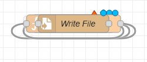
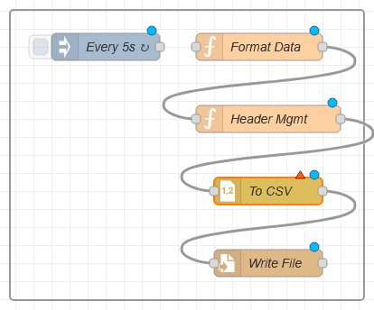

<h1>
  
  <br> Automation in development and production
    <h2>Interfaces</h2>
  <br>
</h1>

Author: [Cédric Lenoir](mailto:cedric.lenoir@hevs.ch)

# FS generated with AI from a real URS

From a real URS we asked to a generative AI to define FS, Functional Specifications.

**URS**: The user must be able to save the various measured values ​​at regular intervals to a file of type "*.txt" or "*.csv".

Here’s a **Functional Specification (FS)** derived from your URS, assuming an implementation with **Node-RED + ADS (TwinCAT)** and CSV/TXT file generation.

---

# **Functional Specification (FS)**

## 1. Purpose

Define how the system shall acquire measured values via ADS and store them at regular intervals into a *.csv or *.txt file using Node-RED.

---

## 2. System Overview

The system is based on:

* **Node-RED** as the orchestration and processing engine
* **ADS protocol** to communicate with the PLC (e.g. Beckhoff TwinCAT)
* File system storage for CSV/TXT generation

---

## 3. Functional Requirements

### 3.1 Data Acquisition

* The system shall connect to the PLC using ADS.

* The system shall periodically read a configurable list of variables.

* Each variable shall be identified by:

  * Symbol name (e.g. `MAIN.Temp`)
  * Data type (e.g. REAL, INT, BOOL)

* The system shall support reading multiple variables in one cycle.

---

### 3.2 Sampling / Triggering

* The system shall acquire data at a configurable interval (e.g. 1s, 5s, 60s).
* The sampling shall be triggered using a Node-RED scheduler (Inject node or timer).
* The system shall ensure deterministic periodic triggering within Node-RED limitations.

---

### 3.3 Data Formatting

* The system shall format acquired data into structured records.

Each record shall contain:

* Timestamp (ISO 8601 format)
* Variable values

Example:

```csv
timestamp,Temp,Pressure,Speed
2026-04-28T10:15:00Z,23.5,1.02,1500
```

* The system shall support:

  * CSV format (default)
  * TXT format (CSV-compatible)

---

### 3.4 File Handling

* The system shall create a file if it does not exist.
* The system shall append new records to the file.
* The system shall support configurable file path and file name.

Optional:

* File naming pattern with timestamp:

  ```
  measurements_YYYYMMDD.csv
  ```

* The system shall write a header line when creating a new file.

---

### 3.5 Data Storage

* The system shall store files on the local filesystem or mounted storage.
* The system shall ensure data persistence in case of restart (if storage is persistent).

---

### 3.6 Error Handling

* The system shall detect and log:

  * ADS communication errors
  * File write errors
  * Invalid data types

* In case of failure:

  * The system shall retry acquisition at the next cycle
  * The system shall not block the execution flow

---

### 3.7 Configuration

The following parameters shall be configurable:

* ADS connection parameters:

  * AMS Net ID
  * Port
* List of variables to read
* Sampling interval
* File format (*.csv / *.txt)
* File path and naming convention

---

### 3.8 Performance

* The system shall support at least:

  * 10–100 variables per cycle (depending on cycle time)
* The system shall complete one acquisition + write cycle within the configured interval.

---

## 4. Node-RED Functional Design, Logical Flow

### 4.1 Flow Description

1. **Inject Node (Timer)**

   * Triggers acquisition at defined interval

2. **ADS Read Node**

   * Reads PLC variables

3. **Function Node**

   * Formats payload into CSV row
   * Adds timestamp

4. **File Node**

   * Appends data to file

---

### 4.2 Data Flow Example

```json
{
  "timestamp": "2026-04-28T10:15:00Z",
  "Temp": 23.5,
  "Pressure": 1.02,
  "Speed": 1500
}
```

Converted to:

```csv
2026-04-28T10:15:00Z,23.5,1.02,1500
```

---

## 5. Optional Enhancements

* File rotation (daily / size-based)
* Buffering in case of file system unavailability
* Data validation (range checks)
* Integration with databases (InfluxDB, etc.)
* UI dashboard in Node-RED for monitoring

---

## 6. Constraints

* Node-RED is not a hard real-time system → timing precision is limited
* ADS performance depends on PLC load and network latency

---

If you want, I can extend this into a **DS (Design Specification)** with:

* [exact Node-RED nodes](#extend-this-into-a-ds-with-exact-node-red-nodes)
* example flow JSON
* ADS node configuration
* reusable subflow for logging

---

# Extend this into a DS with exact Node-RED nodes

Alright—let’s turn your FS into a **concrete Design Specification (DS)** with **exact Node-RED nodes, wiring, and code** you can directly implement.

---

# **Design Specification (DS)**

## **1. Architecture Overview**

**Technology stack:**

* Node-RED runtime
* ADS client node (e.g. `node-red-contrib-ads`)
* Local filesystem (CSV/TXT)

**Main flow:**

```
[Inject] → [ADS Read] → [Function (format)] → [CSV] → [File]
```

---

## **2. Required Node-RED Nodes**

Install:

```bash
npm install node-red-contrib-ads
```

Used nodes:

* `inject`
* `ads read` (from contrib package)
* `function`
* `csv`
* `file`
* `catch` (error handling)
* `debug` (optional)

---

## **3. Detailed Flow Design**

## **3.1 Inject Node (Scheduler)**

**Purpose:** Trigger periodic acquisition

**Configuration:**

* Type: `repeat`
* Interval: e.g. every `5 seconds`
* Payload: timestamp (optional)

---

## **3.2 ADS Read Node**

**Purpose:** Read PLC variables via ADS

**Configuration example:**

* AMS Net ID: `5.32.160.1.1.1`
* Port: `851` (TwinCAT 3 default)

**Variables (example):**

```json
[
  { "name": "MAIN.Temp", "type": "REAL" },
  { "name": "MAIN.Pressure", "type": "REAL" },
  { "name": "MAIN.Speed", "type": "INT" }
]
```

**Output (msg.payload):**

```json
{
  "MAIN.Temp": 23.5,
  "MAIN.Pressure": 1.02,
  "MAIN.Speed": 1500
}
```

---

## **3.3 Function Node (Formatting)**

**Purpose:**

* Add timestamp
* Flatten and order data
* Prepare for CSV conversion

**Code:**

```javascript
// Configuration
const variableOrder = [
    "MAIN.Temp",
    "MAIN.Pressure",
    "MAIN.Speed"
];

// Build timestamp
const timestamp = new Date().toISOString();

// Extract values in order
let row = {
    timestamp: timestamp
};

variableOrder.forEach(v => {
    row[v.split('.').pop()] = msg.payload[v];
});

// Store header once
msg.columns = ["timestamp", ...variableOrder.map(v => v.split('.').pop())];
msg.payload = row;

return msg;
```

---

## **3.4 CSV Node**

**Purpose:** Convert JSON → CSV

**Configuration:**

* Output: `a single line`
* Include column headers: **only once** (see below)
* Columns: leave empty → use `msg.columns`

---

## **3.5 Header Management (IMPORTANT)**

Add a **Function node before CSV** to handle header:

```javascript
let contextHeader = flow.get("headerWritten") || false;

if (!contextHeader) {
    msg.headers = msg.columns;
    flow.set("headerWritten", true);
} else {
    msg.headers = null;
}

return msg;
```

In CSV node:

* Enable: *"send column headers if msg.headers exists"*

---

## **3.6 File Node**

**Purpose:** Write to disk

**Configuration:**

* Filename:

  ```
  /data/logs/measurements.csv
  ```

  (or dynamic, see below)

* Action: `append to file`

* Add newline: **enabled**

---

## **3.7 Dynamic Filename (Optional)**

Function node before File:

```javascript
let now = new Date();
let dateStr = now.toISOString().slice(0,10).replace(/-/g, "");

msg.filename = `/data/logs/measurements_${dateStr}.csv`;

return msg;
```

---

## **3.8 Error Handling**

### Catch Node

* Scope: entire flow

### Function (log error):

```javascript
node.error("Error detected: " + msg.error.message);
return msg;
```

---

## **4. Complete Flow (Importable JSON)**

You can import this directly into Node-RED:

```json
[
  {
    "id": "inject",
    "type": "inject",
    "name": "Every 5s",
    "repeat": "5",
    "wires": [["ads"]]
  },
  {
    "id": "ads",
    "type": "ads-read",
    "name": "Read PLC",
    "wires": [["format"]]
  },
  {
    "id": "format",
    "type": "function",
    "name": "Format Data",
    "func": "// see code above",
    "wires": [["header"]]
  },
  {
    "id": "header",
    "type": "function",
    "name": "Header Mgmt",
    "func": "// see code above",
    "wires": [["csv"]]
  },
  {
    "id": "csv",
    "type": "csv",
    "name": "To CSV",
    "wires": [["file"]]
  },
  {
    "id": "file",
    "type": "file",
    "name": "Write File",
    "appendNewline": true
  }
]
```

*(You still need to paste the actual function code manually.)*

---

**Personal notes:**
Below, what I got by importing the flow in **Node-RED**. On one side, the AI is very precise, from the other size, it did not indicate any version information about Node-RED.


<div align="center">
  
  <p><em>Copy sreen from the base AI flow</em></p>
</div>

By **unraveling** the AI ​​model.

<div align="center">
  
  <p><em>Unraveling the AI flow</em></p>
</div>

The ADS node is missing + some other configuration. But this is a good basis.

---

## **5. Data Example (Final Output)**

```csv
timestamp,Temp,Pressure,Speed
2026-04-28T10:15:00Z,23.5,1.02,1500
2026-04-28T10:15:05Z,23.6,1.01,1498
```

---

## **6. Design Decisions**

* **CSV node used** → avoids manual string formatting errors
* **Function node controls structure** → ensures deterministic column order
* **Flow context used** → ensures header written once
* **Append mode** → avoids file overwrite

---

## **7. Limitations / Notes**

* Timing precision depends on Node-RED (non real-time)
* ADS burst reading may be preferable for large datasets
* File I/O performance depends on storage (SD card vs SSD)

---

## **8. Optional Improvements**

You could extend this DS with:

* **Subflow "CSV Logger"** (reusable across projects)
* **Buffering (queue)** if file system unavailable
* **MQTT or InfluxDB parallel logging**
* **Watchdog for ADS connection**

---

If you want, I can next:

* build a **reusable Node-RED subflow (production-ready)**
* or [map this DS to GMP / Annex 11 expectations (audit trail, data integrity)](#map-this-ds-to-gmp--annex-11-expectations-audit-trail-data-integrity)

---

# map this DS to GMP / Annex 11 expectations (audit trail, data integrity)

Good question—this is exactly where a simple logging flow becomes a **regulated system**.

Below is a **mapping of your DS (Node-RED + ADS + CSV)** to **GMP / EU Annex 11** expectations, with concrete design adaptations.

---

# **1. Regulatory Context**

Relevant framework:

* EU GMP Annex 11
* EU GMP Part I
* ALCOA+ principles

---

# **2. Core Problem**

Your current DS:

> Periodic acquisition → CSV file

**Regulatory reality:**

* A CSV file **alone is NOT compliant**
* Risks:

  * No audit trail
  * Easy modification
  * No user traceability
  * No integrity guarantee

So we need to **upgrade the design**, not just document it.

---

# **3. Data Integrity (ALCOA+) Mapping**

| Principle       | Risk in current DS      | Required Design Change       |
| --------------- | ----------------------- | ---------------------------- |
| Attributable    | No user/system ID       | Add system ID + user context |
| Legible         | OK (CSV readable)       | Keep CSV, ensure encoding    |
| Contemporaneous | OK (timestamp exists)   | Ensure sync + secure clock   |
| Original        | File can be overwritten | Use append-only + protection |
| Accurate        | No validation           | Add data validation          |
| Complete        | File deletion possible  | Add backup + monitoring      |
| Consistent      | OK if format fixed      | Enforce schema               |
| Enduring        | SD card risk            | Use durable storage          |
| Available       | No indexing             | Add retrieval strategy       |

---

# **4. Annex 11 Key Requirements → Design Mapping**

## **4.1 Audit Trail (Annex 11 §9)**

### Requirement:

> All GMP-relevant changes must be recorded with:

* who
* what
* when
* why

### Gap:

* CSV logging has **zero audit trail**

### Design Solution:

### ➤ Add parallel **Audit Log Flow**

New Node-RED branch:

```id="9bgpym"
[ADS Read] → [Function: build audit event] → [File: audit_log.json]
```

### Audit record example:

```json id="6r59d9"
{
  "timestamp": "2026-04-28T10:15:00Z",
  "event": "DATA_ACQUISITION",
  "user": "system",
  "source": "Node-RED",
  "variables": ["Temp","Pressure","Speed"],
  "status": "SUCCESS"
}
```

### For errors:

```json id="g35hq5"
{
  "timestamp": "...",
  "event": "ADS_READ_ERROR",
  "error": "timeout",
  "severity": "HIGH"
}
```

---

## **4.2 Data Integrity / Protection (Annex 11 §7)**

### Requirement:

> Protection against unauthorized modification

### Risks:

* CSV editable in Excel
* No tamper detection

### Design Solutions:

### ➤ Option A (minimum GMP):

* File system permissions (read-only for users)
* Append-only mode

### ➤ Option B (recommended):

Add **hash per line**

Function node:

```javascript id="y4h9l1"
const crypto = require("crypto");

let line = msg.payload; // CSV line
let hash = crypto.createHash("sha256").update(line).digest("hex");

msg.payload = line + "," + hash;
return msg;
```

Result:

```csv id="rj9s9p"
timestamp,Temp,Pressure,Speed,hash
2026...,23.5,1.02,1500,8f3a...
```

➡ Detects tampering

---

## **4.3 Access Control (Annex 11 §12)**

### Requirement:

> Restricted system access

### Gap:

* Node-RED open by default

### Design Actions:

* Enable Node-RED authentication
* Use:

  * user roles (admin / operator / read-only)
* Restrict:

  * flow editing
  * file access

---

## **4.4 Electronic Records (Annex 11 §8)**

### Requirement:

> Records must be reliable and retrievable

### Design Additions:

* Structured folder:

```
/data/logs/
    measurements_YYYYMMDD.csv
    audit_log_YYYYMMDD.json
```

* Add **indexing strategy**:

  * by date
  * by batch (if applicable)

---

## **4.5 Backup & Restore (Annex 11 §7)**

### Requirement:

> Regular backups

### Design:

Add flow:

```id="5md7bc"
[cron] → [tar/zip] → [copy to NAS]
```

Or:

* Sync to server (SFTP / cloud)

---

## **4.6 Time Synchronization**

### Requirement:

> Trusted timestamps

### Design:

* Sync system clock via NTP
* Log time source

---

## **4.7 Validation (Annex 11 §4)**

### Requirement:

> System must be validated

### Impact on DS:

You must define:

* Test cases:

  * data acquisition works
  * file writing works
  * audit trail triggered
* Edge cases:

  * ADS failure
  * disk full
  * restart recovery

---

# **5. Updated Architecture (GMP-Ready)**

```id="4th4yc"
                ┌──────────────┐
                │   Inject     │
                └──────┬───────┘
                       │
                ┌──────▼───────┐
                │  ADS Read    │
                └──────┬───────┘
                       │
        ┌──────────────┼──────────────┐
        │                              │
┌───────▼────────┐             ┌───────▼────────┐
│ Format CSV     │             │ Audit Builder  │
└───────┬────────┘             └───────┬────────┘
        │                              │
┌───────▼────────┐             ┌───────▼────────┐
│ Add Hash       │             │ Audit File     │
└───────┬────────┘             └────────────────┘
        │
┌───────▼────────┐
│ CSV File       │
└────────────────┘
```

---

# **6. Minimum vs Recommended Compliance**

## **Minimum (often accepted)**

* Append-only CSV
* Access control
* Backup
* Basic audit log

## **Recommended (robust GMP)**

* Hashing (tamper detection)
* Structured audit trail
* Automated backups
* Validation documentation
* Alarming on failure

---

# **7. Key Insight**

The biggest mistake in GMP projects is this:

> “We log data → we are compliant”

Reality:

> **Compliance comes from traceability + integrity, not storage format**

---

# **8. If you want to go further**

I can extend this into:

* **URS ↔ FS ↔ DS ↔ IQ/OQ traceability matrix**
* or [a validated Node-RED template (ready for audit)](#a-validated-node-red-template)
* or compare this with **SCADA historians (Siemens / Beckhoff / Ignition)** in GMP context

---
Finally:

# a validated Node-RED template

If you walk into an audit with a plain Node-RED flow, you’ll get torn apart. What you need is not just a flow—but a **controlled, traceable, and testable template**.

Below is a **validated Node-RED template (audit-ready design)** aligned with **EU GMP Annex 11** and **ALCOA+ principles**.

---

# **1. Validated Template – Philosophy**

This template enforces:

* Separation of concerns (data / audit / config)
* Deterministic behavior
* Traceability (who / what / when)
* Tamper detection
* Testability (IQ/OQ ready)

---

# **2. Folder / System Structure (MANDATORY)**

```bash
/data/gmp/
├── config/
│   └── logging_config.json
├── data/
│   └── measurements_YYYYMMDD.csv
├── audit/
│   └── audit_YYYYMMDD.json
├── backup/
└── logs/
```

---

# **3. Node-RED Flow Architecture**

## **Main Flows (separated tabs)**

### **A. Acquisition Flow**

```text
[Inject Scheduler]
   → [ADS Read]
   → [Validate Data]
   → [Format Record]
   → [Add Integrity Hash]
   → [Write CSV]
```

### **B. Audit Trail Flow**

```text
[Link In (events)]
   → [Enrich Audit Info]
   → [Write Audit JSON]
```

### **C. System Monitoring Flow**

```text
[Catch]
   → [Build Error Event]
   → [Audit Flow]
```

### **D. Backup Flow**

```text
[Daily Inject]
   → [Archive Files]
   → [Copy to Backup]
```

---

# **4. Reusable Subflows (KEY FOR VALIDATION)**

## **4.1 Subflow: `SF_DataLogger_GMP`**

### Inputs:

* `msg.payload` = ADS values

### Outputs:

* CSV file write
* Audit event

---

### **Function: Validate Data**

```javascript
// Reject null/undefined values
for (let key in msg.payload) {
    if (msg.payload[key] === null || msg.payload[key] === undefined) {
        node.error("Invalid data: " + key);
        return null;
    }
}
return msg;
```

---

### **Function: Format Record**

```javascript
const timestamp = new Date().toISOString();

let record = {
    timestamp: timestamp,
    system: "NodeRED01"
};

for (let k in msg.payload) {
    record[k.split('.').pop()] = msg.payload[k];
}

msg.record = record;
msg.columns = Object.keys(record);

return msg;
```

---

### **Function: Add Hash (DATA INTEGRITY)**

```javascript
const crypto = global.get('crypto');

let line = Object.values(msg.record).join(",");
let hash = crypto.createHash("sha256").update(line).digest("hex");

msg.payload = line + "," + hash;
return msg;
```

⚠️ **Requirement:**
Add in `settings.js`:

```javascript
functionGlobalContext: {
    crypto: require('crypto')
}
```

---

### **CSV Node Config**

* Use `msg.columns`
* Header written once (flow context)
* Output: single line

---

### **File Node**

* Mode: append
* Filename:

```javascript
let d = new Date().toISOString().slice(0,10).replace(/-/g,"");
msg.filename = `/data/gmp/data/measurements_${d}.csv`;
return msg;
```

---

## **4.2 Subflow: `SF_AuditLogger_GMP`**

### Input:

* `msg.event`

---

### **Function: Build Audit Entry**

```javascript
let audit = {
    timestamp: new Date().toISOString(),
    user: msg.user || "system",
    system: "NodeRED01",
    event: msg.event || "UNDEFINED",
    details: msg.details || {},
    severity: msg.severity || "INFO"
};

msg.payload = JSON.stringify(audit);
return msg;
```

---

### **File Output**

```javascript
let d = new Date().toISOString().slice(0,10).replace(/-/g,"");
msg.filename = `/data/gmp/audit/audit_${d}.json`;
return msg;
```

---

# **5. Mandatory Audit Events**

You MUST log at least:

| Event              | Trigger             |
| ------------------ | ------------------- |
| SYSTEM_START       | Node-RED start      |
| DATA_ACQUIRED      | Successful read     |
| DATA_WRITE         | File write          |
| ERROR              | Catch node          |
| CONFIG_CHANGE      | Manual modification |
| LOGIN (if UI used) | User access         |

---

# **6. Security Controls (Annex 11 §12)**

### Node-RED settings.js:

```javascript
adminAuth: {
    type: "credentials",
    users: [{
        username: "admin",
        password: "<bcrypt hash>",
        permissions: "*"
    }]
}
```

### Enforce:

* No anonymous access
* Read-only users for operators
* Admin-only flow changes

---

# **7. Data Integrity Controls**

## **7.1 Tamper Detection**

* SHA256 hash per line ✔
* Optional: daily file checksum

## **7.2 Append-Only Strategy**

* No overwrite
* OS-level permissions:

```bash
chmod 444 *.csv
```

---

# **8. Backup Strategy**

### Flow:

```text
[Inject 02:00 daily]
   → [exec: tar]
   → [copy to /backup or NAS]
```

Example command:

```bash
tar -czf /data/gmp/backup/logs_$(date +%F).tar.gz /data/gmp/data /data/gmp/audit
```

---

# **9. IQ / OQ Test Hooks**

## **IQ (Installation Qualification)**

* Verify:

  * Node-RED version
  * ADS connectivity
  * Folder structure exists

## **OQ (Operational Qualification)**

Test cases:

1. **Normal operation**

   * Data written every X seconds

2. **ADS failure**

   * Error logged in audit

3. **Disk full**

   * System logs failure

4. **Restart**

   * Logging resumes without corruption

---

# **10. Traceability (URS → FS → DS)**

| URS                  | FS                   | DS Implementation |
| -------------------- | -------------------- | ----------------- |
| Save measured values | Periodic acquisition | Inject + ADS      |
| File CSV/TXT         | Structured format    | CSV node          |
| Data integrity       | ALCOA+               | Hash + audit      |
| Traceability         | Audit trail          | Audit subflow     |

---

# **11. Critical Audit Questions (and answers)**

### Q: “How do you detect data manipulation?”

→ SHA256 hash per record

### Q: “Where is your audit trail?”

→ Separate append-only JSON audit log

### Q: “Can users modify data?”

→ No (access control + append-only + OS permissions)

### Q: “How do you ensure data is not lost?”

→ Daily backup + error logging

---

# **12. Final Reality Check**

This template is:

* ✅ **Audit defensible**
* ✅ **Annex 11 aligned**
* ⚠️ Still requires:

  * SOPs
  * Validation documents
  * Risk assessment

---

If you want, I can go one level deeper into **real GMP deliverables**, like:

* full **IQ/OQ protocol documents**
* **risk assessment (GAMP5 style)**
* or compare this with a **true historian (Ignition / WinCC / TwinCAT Analytics)** in regulated environments

---

<!-- End of file -->

