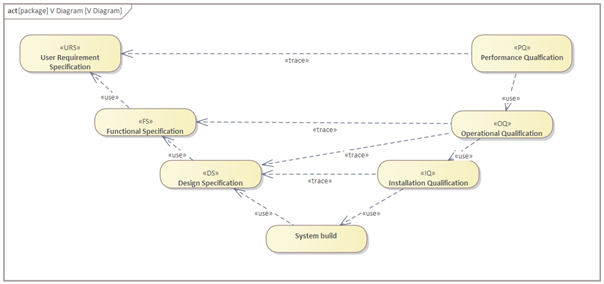
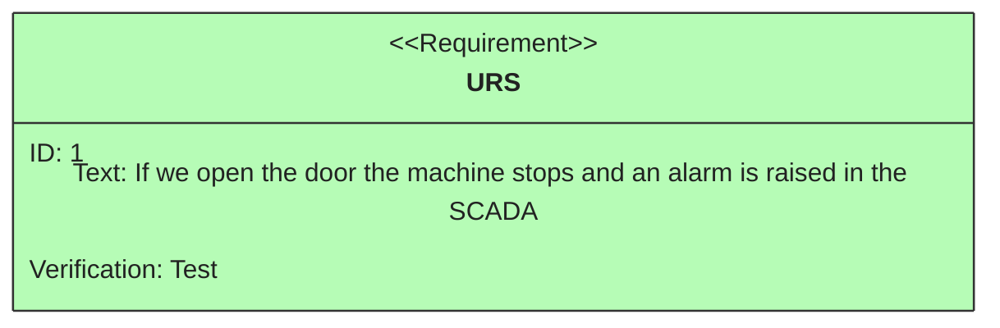
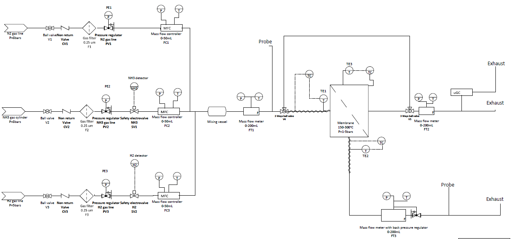
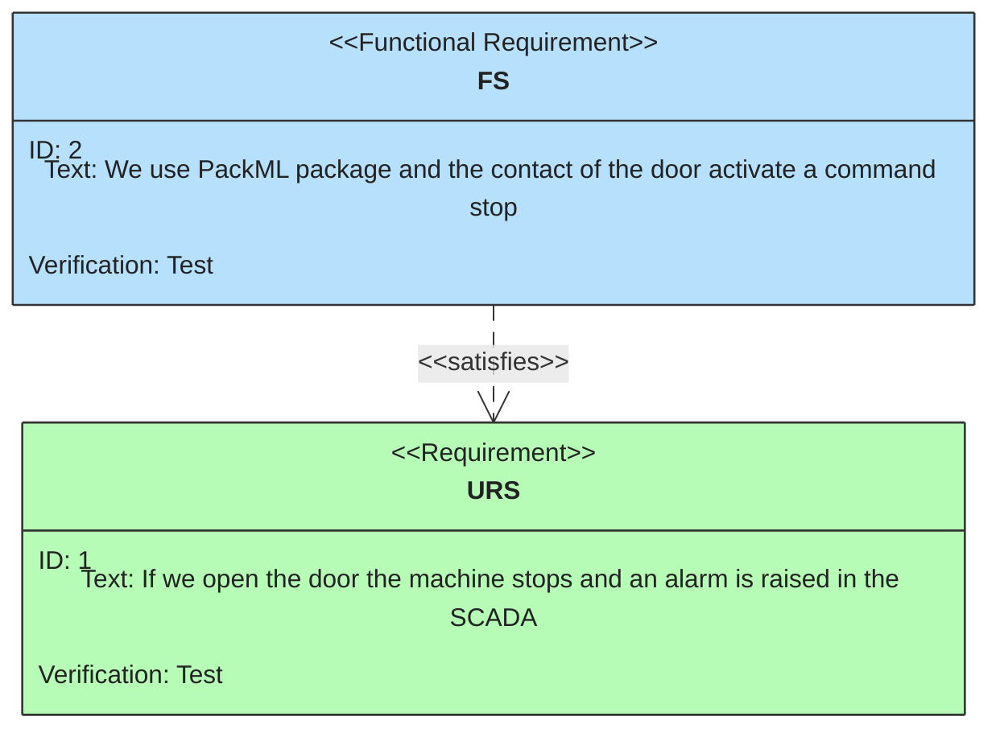
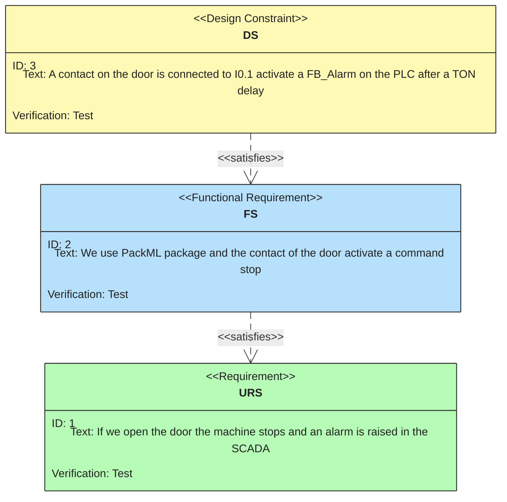
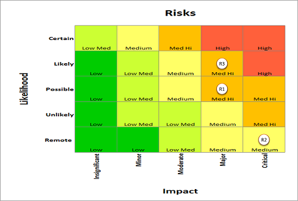
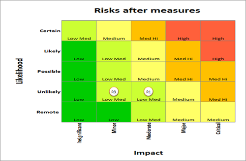
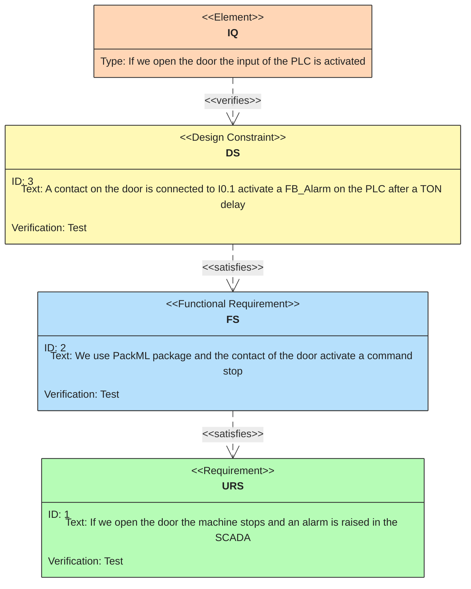
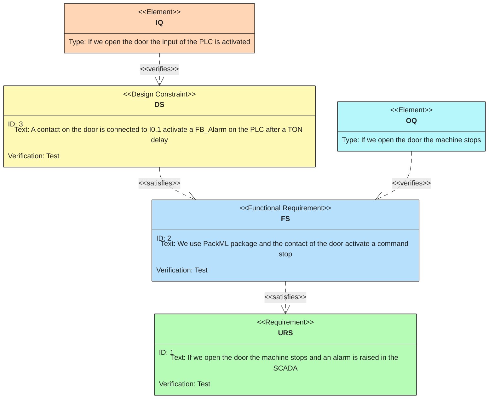
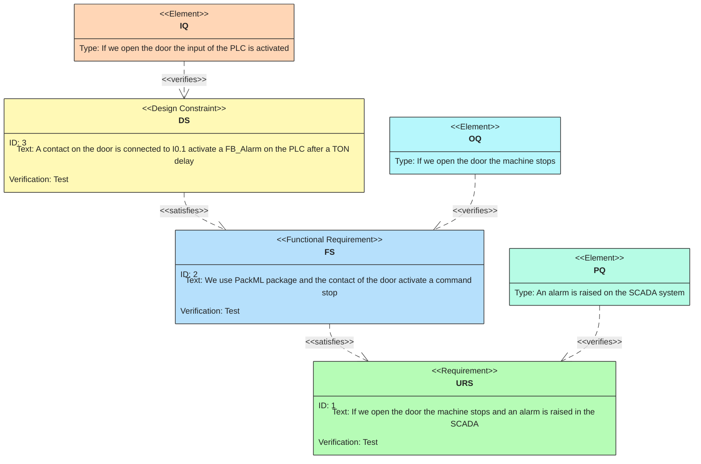

<h1>
  
  <br> Automation in development and production
    <h2>Interfaces</h2>
  <br>
</h1>

Author: [Cédric Lenoir](mailto:cedric.lenoir@hevs.ch)

# Good Manufacturing Process

*Keywords:* **GMP URS FS DS HDS SDS IQ OQ PQ FMEA Safety Risk Matrix V-Diagram**

[Implementation of PAT applications should conform to current Good Manufacturing Practices](./documentation/VAL-MANUAL-051-Implementation-of-Process-Analytical-Technology-sample.pdf) **cGMPs**.

## Sommaire

- [Good Manufacturing Process](#good-manufacturing-process)
  - [Sommaire](#sommaire)
  - [Objective](#objective)
  - [About the attached documents](#about-the-attached-documents)
  - [Key points](#key-points)
    - [Main Causes of Automation Project Failure](#main-causes-of-automation-project-failure)
  - [Ins and Outs](#ins-and-outs)
  - [GMP](#gmp)
  - [GAMP5](#gamp5)
  - [V-Diagram](#v-diagram)
    - [Origin of the V-Diagram](#origin-of-the-v-diagram)
- [Specifications](#specifications)
  - [URS, User Request Specification](#urs-user-request-specification)
  - [An example for a test bench](#an-example-for-a-test-bench)
    - [Inaccuracies related to this URS](#inaccuracies-related-to-this-urs)
      - [Exemple d'Analyse des Exigences](#exemple-danalyse-des-exigences)
      - [Tip](#tip)
  - [FS, Functional Specification](#fs-functional-specification)
    - [FS Safety Valves](#fs-safety-valves)
    - [Best practice](#best-practice)
  - [DS, Design Specification](#ds-design-specification)
    - [Example](#example)
  - [FMEA, Risk Analysis](#fmea-risk-analysis)
  - [Tests](#tests)
    - [IQ Installation Qualifications](#iq-installation-qualifications)
      - [Some Key Points](#some-key-points)
    - [OQ Operational Qualifications](#oq-operational-qualifications)
    - [PQ Performance Qualifications](#pq-performance-qualifications)
  - [We also use](#we-also-use)
  - [Quality Management Process](#quality-management-process)
    - [Document Management](#document-management)
      - [Change Management](#change-management)
      - [Configuration Management](#configuration-management)
      - [Incident Management](#incident-management)
      - [Supplier Management](#supplier-management)
      - [Records Management](#records-management)
      - [Archiving](#archiving)
      - [Training Management](#training-management)
      - [Periodic Evaluation](#periodic-evaluation)
      - [Safety](#safety)
    - [Some Examples](#some-examples)
- [Memo](#memo)

## Objective
This module does not aim to cover all GMP elements; it provides some basics with a practical approach that will be supplemented by two modules in the form of mini-projects.

## About the attached documents
This module provides a series of attached documents, primarily for managing the V-shaped diagram mentioned below. These types of documents are not easy to find online. That is why they are provided here.

## Key points
Understand the meaning of the different keywords and place them in the context of an automation project.

---

### Main Causes of Automation Project Failure

1. Poorly Defined Requirements **URS**
An incomplete or incorrect definition of user requirements **URS** can lead to significant discrepancies between expectations and the final result.

**Reference** : Sommerville, I. (2011). *Software Engineering*.

1. Ineffective Project Management
A lack of **planning**, communication, or follow-up can lead to delays, budget overruns, or low-quality deliverables. 
**Reference** : Kerzner, H. (2017). *Project Management: A Systems Approach to Planning, Scheduling, and Controlling*.

1. Underestimating Resources
Failing to allocate sufficient time, budget, or qualified personnel can jeopardize project success. *Resource estimation is impossible without complete and accurate **URS**. 
**Reference** : PMI (2021). *A Guide to the Project Management Body of Knowledge (PMBOK® Guide)*.

1. Resistance to Change
End users may be reluctant to adopt new systems, especially if training or support is insufficient.  
**Reference** : Kotter, J. P. (1996). *Leading Change*.

1. Technical Problems
Errors in the software design **SDS** or hardware design **HDS** can lead to failures or incompatibilities.  
**Reference** : Pressman, R. S. (2014). *Software Engineering: A Practitioner's Approach*.

1. Inadequate Testing
Incomplete or poorly executed tests, **IQ**, **OQ**, **PQ**, can allow critical defects to pass.  
**Reference** : Myers, G. J., Sandler, C., & Badgett, T. (2011). *The Art of Software Testing*.

1. Lack of Risk Management
Failure to anticipate potential risks can exacerbate problems when they occur. **FMEA** 
**Reference** : Hillson, D. (2003). *Effective Opportunity Management for Projects*.

<div style="color: red; font-weight: bold;" align="center">
Note that at no point is it specified that the failure was due to technical problems related to the coding!
</div>

---

## Ins and Outs
- The purely technical aspect of an automation project is only one factor among many that contribute to a project's success.
- Basic automation, as seen in this module, should be viewed as an integration of different components. PLC programming, in the IACS sense, often based on IEC-61131-3, should be seen as the core of a complete system that includes, among other things:
- A user interface. **Node-RED** in our case
- A communication system composed of different networks and subnetworks.
- Sensors and actuators, which can be electrical, pneumatic, or hydraulic.
- Mechanical assemblies and sub-assemblies.
- Various processor-based modules that can be distributed across the sensors or actuators.
- System modeling, whether at the structural level, class and object diagrams, or at the behavior level, primarily represented as state diagrams.
- Securing the entire system.
- Control systems composed of one, but often several, controllers.
- Complexity arises from managing a set of domains without losing sight of the objective, which is to meet a given specification.

## GMP
GMP is an acronym primarily used in the pharmaceutical industry. Companies specializing in industrial automation also apply this principle to other industries because experience shows it significantly improves the final project outcome.

GMP, or **Good Manufacturing Practices**, are guidelines that provide a framework to ensure products are manufactured consistently and in a controlled manner according to appropriate quality standards. In the context of process automation, GMP focuses on validating and verifying automated systems to ensure they operate correctly and reliably. This includes rigorous documentation of specifications, tests, and maintenance procedures to guarantee that automated systems meet regulatory and quality requirements throughout their lifecycle.


<div style="font-weight: bold;" align="center">
    A free translation of GMP into French would be:
</div>
<div style="color: red; font-weight: bold;" align="center">
  "Travailler dans les règles de l'art"
</div>


## GAMP5 
GAMP5, or **Good Automated Manufacturing Practice 5**, is a guide to **good practices** for validating automated systems in the pharmaceutical and regulated industries. It provides a lifecycle-based framework to ensure that automated systems are fit for purpose and comply with regulatory requirements.

The guide emphasizes a risk-based approach to validation, focusing on aspects critical to product quality and patient safety. GAMP5 also encourages proportionate and pragmatic documentation, avoiding unnecessary excess while ensuring compliance.

For more information, you can consult the official resources or publications of the ISPE, [International Society for Pharmaceutical Engineering](https://ispe.org/about), the organization behind GAMP.


<div align="center">
  
  <p><em>Source Lonza Visp</em></p>
</div>

## V-Diagram
### Origin of the V-Diagram

The V-Diagram, or V-chart, is a project management methodology widely used in systems engineering, software development, and industrial automation. It originated in the 1980s as part of efforts to structure and formalize the development processes of complex systems.

The V-Diagram was initially developed by organizations working on critical engineering projects, such as those in the aerospace, defense, and automotive sectors. It was designed to address the need to ensure the traceability, quality, and validation of systems throughout their lifecycle.

The V-Diagram emphasizes a sequential and structured approach, where each design and development phase is associated with a corresponding testing and validation phase. This methodology is particularly useful for managing projects where safety, reliability, and regulatory compliance are priorities.

Today, the V-Diagram is widely adopted in various industrial sectors and remains a key tool for ensuring the success of complex projects.

<div align="center">
  
  <p><em>Representation of the V-Diagram</em></p>
</div>

# Specifications

## URS, User Request Specification
The URS defines the needs. What are the main functionalities required? The URS must reflect the future user acceptance criteria, which will be validated by a **Performance Qualification**, **PQ**, procedure.



> The User Requirements Specification, **URS**, is the client's work. The automation engineer's task is to say: I will not begin work until I have validated the URS provided by the client. The **URS** defines the answer to the question: **What?**

It is important to understand that the further the project progresses, the more complex and time-consuming it will be to adapt the system to a change in specifications.

<div style="font-weight: bold;" align="center">
    The job of a young engineer is not to define the URS, but:
</div>
<div style="color: red; font-weight: bold;" align="center">
    "to demand to have received and validated it before starting work."
</div>

## An example for a test bench
Here, we assume that the components have already been selected by the client and that the client provides a **P&ID** diagram, **piping and instrumentation diagram**, with the different devices. The client provides a specification for implementing the control system via a PLC, the User-Interface is implemented using Node-RED.

<div align="center">
  
  <p><em>P&ID Gas Unit</em></p>
</div>

1. The user interface must provide an overview of the test bench, displaying the various measured parameters and the status of the instruments: SV1-2, FC1-3, FT1-3, TT.
2. The user must be able to read the pressure, temperature, and flow rate values ​​for the MFC and MFM in real time: FC1-3, FT1-3.
3. The user must be able to modify the gas composition for the MFC and MFM: FC1-3, FT1-3 from the user interface.
4. The user must be able to adjust the flow rate of the MFC: FC1-3.
5. The user must be able to adjust the upstream pressure for the MFM: FT3.
6. The user must be able to read the temperature of the heating elements: TE1-3.
7. The user must be able to control and regulate the temperature of the heating elements. 8. The user must be able to open/close the safety valves: SV1-2.
9. The user must be able to save the various measured values ​​at regular intervals to a file of type "*.txt" or "*.csv". [See IA FS example for this URS here](FS_TheUserMustBeAbleToSaveTheVariousMeasuredCalues.md).
10. The user must be able to save and open a configuration file for the various bench elements.

Comment on this:

> Generative AI is possible, but not exclusively, for analyzing a URS. The few experiments conducted after the project showed that AI often highlighted certain problems that had actually occurred during the project design.

### Inaccuracies related to this URS

#### Exemple d'Analyse des Exigences

1. **Test Bench Overview**
- **Inaccuracy**: The "different measured quantities" are not exhaustively specified. Which exact parameters should be displayed?
- **Suggestion**: Detail all measured quantities and their display format.

2. **Real-Time Value Readings**
- **Inaccuracy**: The real-time value update frequency is not defined.
- **Suggestion**: Specify the frequency (e.g., every 100 ms, 1 s, etc.).

3. **Gas Composition Modification**
- **Inaccuracy**: The modification limits (allowed ranges) are not mentioned.
- **Suggestion**: Define the acceptable value ranges for each gas.

4. **MFC Flow Rate Adjustment**
- **Inaccuracy**: Measurement units and adjustment ranges are not specified.
- **Suggestion**: Specify units (e.g., L/min) and flow rate ranges.

5. **MFM Upstream Pressure Adjustment**
- **Inaccuracy**: Pressure range and units are not specified.
- **Suggestion**: Add ranges and units (e.g., bar, psi).

6. **Heating Element Temperature Reading**
- **Inaccuracy**: Temperature ranges and units are not defined.
- **Suggestion**: Specify ranges and units (e.g., °C).

7. **Temperature Control and Regulation**
- **Inaccuracy**: Control algorithms (PID, etc.) and setpoint ranges are not specified.
- **Suggestion**: Describe the type of regulation and the setpoint ranges.

8. **Opening/Closing Safety Valves**
- **Inaccuracy**: The safety conditions for opening/closing are not specified.
- **Suggestion**: Define the conditions and usage scenarios.

9. **Saving Measured Values**
- **Inaccuracy**: The saving frequency and file format are not detailed.
- **Suggestion**: Indicate the frequency (e.g., every 10 seconds) and the file columns.

10. **Saving and Opening a Configuration File**
- **Inaccuracy**: The exact content of the configuration file is not specified.
- **Suggestion**: Describe the parameters to be included in the file and their format.

It is interesting to note that many of the problems identified in retrospect in these examples also surfaced in the actual project.

#### Tip
- Review the URS.
- Develop your FS to verify that the conditions are met.
- Have it approved after review.
- Do not provide a time estimate until the URS is complete; it's suicidal.
- Even if a problem is not your responsibility because it's not in the URS, it will be your fault.

|Function|Check by system engineer|Comment by system engineer|Risk|
|--------|------------------------|--------------------------|----|
|Change in gas composition|April 3, 2025|Does the device allow it? |High|
|Save measured values|April 3, 2025|Data duration and frequency?|Low|
|Opening/Closing of safety valves|April 3, 2025|When, conditions?|Medium|

## FS, Functional Specification

The FS defines the behavior: **How ?** What functionalities are required? The **FS** defines how the system should operate and how it should be used. The **FS** represents the operational acceptance criteria, which will be validated by an **Operational Qualification**, **OQ**, procedure.



The Functional Specification (FS) is primarily the engineer's work. It describes how the machine will be built to meet the User Requirements Specification (URS).

**The FS primarily answers the question "How?"**

### FS Safety Valves

|ID |Description |
|------|----------------|
||**Automatic Mode**|
|1 |*Normal State*|
|1.1|The valves remain closed as long as the system is in a state other than **Starting** and no H2 gas detection is reported.|
|2 |*H2 Gas Detection*|
|2.1|If the sensor detects an H2 concentration exceeding the configured threshold,|
|2.2|The valves close immediately.|
|2.3|A **Stop** level alarm is activated.|
|2.4|The H2 concentration level is displayed for information.|
|3 |*Transition to Starting State*|
|3.1|The valves open automatically to allow system operation.|
|4 |*H2 Detection Threshold*|
|4.1|The threshold is configurable between 0% and 10%.|
||**Manual Mode**|
|5|*Manual Valve Opening*|
|5.1|In manual mode, the valves can be activated from the user interface if the PackML reaches the Stopped state.|

### Best practice
- The FS also allows you to validate the URS and to verify with the client that they understand and approve them.
- If useful or necessary, supplement the FS with an activity diagram.

```mermaid
flowchart LR
    A [Automatic Mode] --> B [Normal State]
    B --> B1 [The valves remain closed as long as the system is in a state other than Starting and no H2 gas detection is reported.]
    A --> C [H2 Gas Detection]
    C --> C1 [The sensor detects an H2 concentration exceeding the configured threshold]
    C1 --> C2 [The valves close immediately]
    C2 --> C3 [A Stop level alarm is activated]
    C3 --> C4 [The H2 concentration level is displayed for information]
    A --> D [Transition to Starting State]
    D --> D1 [The valves open automatically to allow system operation]
    A --> E [H2 Detection Threshold]
    E --> E1 [The threshold is configurable between 0% and 10%]
    F [Manual Mode] --> G [Manual Valve Opening]
    G --> G1 [In manual mode, the valves can be activated from the user interface if the Stopped state of the PackML is reached]
```


## DS, Design Specification

The DS defines the implementation details. The DS defines how the functions are implemented.
If in traditional coding, the Design Specification, or more precisely, the SDS, Software Design Specification we often use UML, Unified Modeling Language to design the software, with a graphical langage like Node-RED, we could directly use a small view of the code, for exemple a group.



**They will be validated by an Installation Qualification (IQ) procedure.

In practice, we mainly refer to **DS**, which can be divided into **HDS** and **SDS**.

The **HDS**, or Hardware Design Specification, includes everything from sensors and actuators to the PLC input. A good example of what you will find in the **HDS** is the electrical schematic.

The **SDS**, or Software Design Specification, includes everything related to the software, primarily UML diagrams.

### Example
An SDS allows you to link each software element to the hardware elements, i.e., the electrical schematic.

The table below is an excerpt from a [complete SDS provided in the appendix](./documentation/TestBenchSpecification.xlsx).

|Instrument|Device object|Device Class |Fieldbus|Description|Measured Value|IO-Module|Slot|
|----------|-------------|-------------|--------|-----------|--------------|---------|----|
|BL-1	|dmBL_1	|DM_BL_DO		||Piston pump, blower 8009-35/05/DC	Pressure (P-2) / Bars / 0-2	|EL2008	|5
|BL-2	|dmBL_2	|DM_BL_DO		||Piston pump, blower 8009-35/05/DC	Pressure (MFM-5) / Bars / 0-2	|EL2008	|6
|C-1	|dmC_DO	|DM_C_DO		||Compressor 405 Series		|EL2008	|7
|CO2-1	|dmCO2_1	|DM_Hamilton_485	|Modbus	|CO2 sensor - 0-100% 	CO₂ concentration / %-vol / 0-100	|EL6022 	|10
|CO2-2	|dmCO2_2	|DM_Hamilton_485	|Modbus	|CO2 sensor - 0-100% 	CO₂ concentration / %-vol / 0-100	|EL6022 	|10
|CO2-3	|dmCO2_3	|DM_SmartGas_485	|Modbus	|CO2 sensor 0-20%	CO₂ concentration / %-vol / 0-20	|EL6022 	|10
|CO2-4	|dmCO2_4	|DM_Hamilton_485	|Modbus	|CO2 sensor - 100%	CO₂ concentration / %-vol / 0-100	|EL6022 	|10|
|CO2-5	|dmCO2_5	|DM_SmartGas_485	|Modbus	|CO2 sensor - 100%	CO₂ concentration / %-vol / 0100%|EL6022 	|10|		
|Emergency stop button		||DM_E_Stop_In			||Status / On-Off / -	|EL1008	|3|


Depending on the industry or company practices, the following definitions may also be used:

- CS, Configuration Specification
- SMS, Software Module Specification
- NDS, Network Specification

---

## FMEA, Risk Analysis

An FMEA is a design and engineering tool that analyzes potential failure modes within a system to determine the impact of these failures.

It was initially developed by the U.S. Department of Defense for use in systems design. The FMEA technique has since been adopted by commercial industries to minimize failures and reduce safety, as well as the environmental and economic impacts that could result from these failures.

- An FMEA is used to assess project risks, particularly critical points.

- An FMEA is used to anticipate problems and propose contingency plans.

<div align="center">
  
  <p><em>FMEA before risk reduction</em></p>
</div>

<div align="center">
  
  <p><em>FMEA after risk reduction</em></p>
</div>

Attached to the documentation is the file used to generate the two examples above. This file is from [Innosuisse, the Swiss Innovation Agency](https://www.innosuisse.admin.ch/fr), and is used for risk analysis when applying for funding for innovation projects. Feel free to use it.


<div style="font-weight: bold;" align="center">
  In case of a problem, it's not about looking for a solution, but...
</div>
<div style="color: red; font-weight: bold;" align="center">
  "to have anticipated and to propose one."
</div>

---

## Tests

**Anticipate testing**
LTest plans should be written before the machine is built. This is an advantage for engineers because they know in advance how their work will be tested.

In a validation project, test plans or test protocols are used to demonstrate that a system meets the requirements previously established in the specification, design, and configuration documents.

- Test plans document the overall testing strategy.

- Test protocols are the **actual test documents**. They are generally required to be **completed and signed by hand**.

The test plan describes the requirements and the testing strategy. It must include the overall process for performing the tests, documentation of the test evidence, and the process for handling test failures.

### IQ Installation Qualifications

**Used to validate the Design Specification.**

Verifies that the systems are located on machines suitable for running the software, that the system has been correctly installed, and that the configuration is correct. These requirements are described in the Design Specification.



#### Some Key Points
Before verifying that the subsystems are functioning correctly, IQ ensures that everything has been tested. This is more important than simply knowing if the systems are working correctly.

**Benefits for the Engineer:** A large part of the work in **DS** will be carried out by contractors. The engineer who moves on to the **OQ** phase should no longer have to worry about the execution of the **DS**.

> Example: If an electrician wires a machine, it is the electrician's responsibility to validate their work before considering it complete.

### OQ Operational Qualifications

Verifies that the systems function as intended. **OQs test the FS,** Functional Specification, or functional requirements.



The customer should be involved in the OQ process. This allows them to validate each specification element by element and accept them.

**Benefits for the engineer:** Obtain customer acceptance of all modules and more easily negotiate any modifications that may be necessary before final commissioning. **The OQ phase generally takes place in the workshop**, see below **FAT**. Any subsequent modifications will be more complex to implement, primarily for logistical reasons.

> Some companies already invoice up to 90% of the machine cost after the customer has validated the operational qualification.

### PQ Performance Qualifications
Verifies that systems perform tasks under real-world conditions. **PQ tests verify the functionality described in the URS**, User Requirements Specification.



**Important for the engineer:** to obtain **final** acceptance of the machine from the client. Any subsequent modifications will be subject to negotiation and can more easily be considered an extension of the mandate.
<div style="font-weight: bold;" align="center">
  Have your client validate and sign the machine acceptance; this will protect you against any further modification requests.
</div>
<div style="color: red; font-weight: bold;" align="center">
  "which you will finally be able to bill at a true engineer's rate."
</div>

## We also use
> **FAT** Factory Acceptance Test
> > This means the customer acceptance test at the factory. Here, "factory" refers to the machine's manufacturing site, in cases where a machine is assembled at the supplier's facility. The term **FAT** is partly related to **PQ** and **OQ**. **This concept should be understood by visualizing a machine intended to be integrated as a unit in a production line.**

> > It then becomes clearer that some of the **OQ** and **PQ** requirements can only be tested and accepted once the machine is integrated into its final environment. From an accountant's perspective, the success of the Factory Acceptance Test (FAT) sometimes determines, for the supplier, the stage at which the customer will pay a significant portion of the final invoice…

> **SAT** Site Acceptance Test
> > On-site acceptance testing involves validating, in the final environment, the Operational Qualification (OQ) and Preliminary Qualification (PQ) tests that could not be performed at the machine's manufacturing site.

---

## Quality Management Process
### Document Management

Document management involves the creation, review, approval, distribution, and archiving of documents necessary to ensure process quality and compliance.

In addition to the documents mentioned below, the following can be added:

#### Change Management

Change management ensures that all modifications to processes, systems, or products are properly controlled and documented to maintain quality and compliance.

#### Configuration Management

Configuration management involves tracking and controlling product and system versions to ensure that changes are correctly implemented and documented.

#### Incident Management

Incident management involves identifying, documenting, and resolving incidents that could affect the quality or compliance of products or processes.

Supplier Management

#### Supplier Management

Supplier management involves evaluating and monitoring suppliers to ensure they meet the required quality and compliance standards. Records Management

#### Records Management

Records management ensures that all necessary records are created, maintained, and accessible to demonstrate process compliance and quality.

These records also include archiving **all** **software** and **versions** that allow for machine restoration should a device need to be replaced. **SOPs** (Standard Operating Procedures) should also be included, outlining how to quickly restore the machine in case of a crash.

#### Archiving

Archiving involves storing and protecting important documents and records to ensure their future availability and compliance with regulatory requirements.

#### Training Management

Training management ensures that all employees receive the necessary training to perform their tasks correctly and effectively.

#### Periodic Evaluation

Periodic evaluation involves regularly reviewing processes and systems to identify opportunities for improvement and ensure ongoing compliance.

Business Continuity

Business continuity involves planning and implementing measures to ensure that operations can continue in the event of disruptions or emergencies.

#### Safety
To the previous module on safety, we can add **OT safety**.

### Some Examples

> If a machine produces parts for the automotive industry, each part produced will be assigned a serial number that can be linked to a batch of parts shipped to a customer. If a defect detected later presents a problem for the end user, it could be requested to verify that the various tests performed during production were compliant, even if the machine has been put into service in the meantime. See above for the concepts of archiving and recording. The automation engineer will therefore have had to record and archive the tests, but also ensure that the data format of the records can be guaranteed in the long term.

> In an ideal world, the machine will be perfect. In practice, it is likely that at some point it will be necessary to analyze and then modify a software component. A program's readability is just as important as its functionality. For this reason, even a functional program may be rejected if its readability is insufficient.

As described above, the lifespan of a machine or installation can be measured in decades. When selecting the components of an automation system, it is important to ask the following question: Is the selected supplier capable of guaranteeing support, and if necessary, replacement of a component within ten years? We can add the following point, bearing in mind that: "After me, the deluge" is not an option. Is the documentation sufficient for a properly trained engineer to work on the machine?

---


<h3 style="text-align:center;">The best projects are those carried out with rigor.</h3>

# Memo
Here is the list of documents to provide.

- [ ] URS
- [ ] FS
- [ ] HDS
- [ ] SDS
- [ ] IQ
- [ ] OQ
- [ ] PQ
- [ ] Schematic
- [ ] Supplier List
- [ ] Alarm List
- [ ] SOP
- [ ] User Manual and Documentation
- [ ] FMEA


<!-- end of document -->
