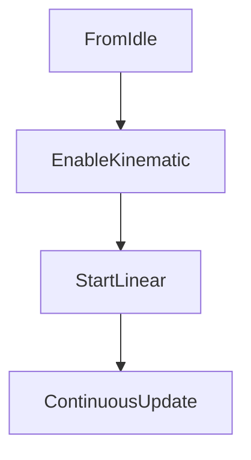

# How to start the robot in production mode




---

## M_RobotActivate

```iecst
//
//  This method is designed to call run action for
//	ACT_RobotDisable if  _xRobotEnable := FALSE;
//  ACT_RobotEnable if _xRobotEnable := TRUE;
//
METHOD M_RobotActivate : DINT
VAR_INPUT
    Enable    : BOOL;
END_VAR
VAR_OUTPUT
    strStatus  : STRING := 'None';
END_VAR
```

```iecst
IF Enable THEN
    // Check conditiona to start procedure
    IF NOT cmModuleAxis_X.Standstill OR
       NOT cmModuleAxis_Y.Standstill OR
       NOT cmModuleAxis_Z.Standstill THEN
       strStatus := 'One axis not standstill';
    END_IF
    IF mxGroupReadStatus.GroupStandby THEN
        strStatus := 'Group already standby';
    END_IF
    
    IF _RobotReadyToEnable THEN
        strStatus := 'Enable kinematic';
        _xRobotEnable := TRUE;
    END_IF
ELSE
    IF _RobotReadyToDisable THEN
        strStatus := 'Disable kinematic';
        _xRobotEnable := FALSE;
    ELSE
        strStatus := 'Kinematic not ready for disable';
    END_IF    
END_IF
diCallCounter := diCallCounter + 1;
M_RobotActivate := diCallCounter;
```

---

## M_MoveLinear
This method call action
ACT_MoveLinear

